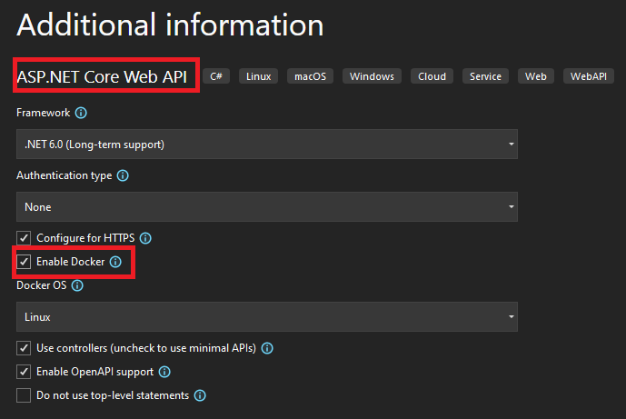
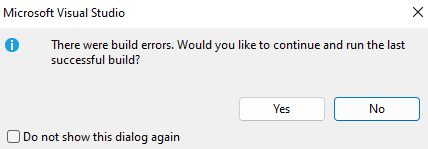

# Example repo for Central Package Management breaking Visual Studio Docker integration

> [!IMPORTANT]
> This repo was used to report [[Bug]: Central Package Management break Visual Studio docker integration #11972](https://github.com/NuGet/Home/issues/11972) which is no longer a problem.

This repo is used to allow easy reproduction of a bug that prevents the users from running an ASP.NET Core Web API project with Docker integration when Central Package Management is enabled.

To run the solution in this repo:

- Open the [CentralPackageManagementExample solution](/CentralPackageManagementExample.sln) at the root of the repo.
- Set the `CentralPackageManagementWithDocker` project as the startup project.
- Set the launch profile to `Docker`.
- Debug the app through Visual Studio.
- You'll get a prompt which won't allow the debugging process to carry on as expected.

CPM is enabled by adding `<ManagePackageVersionsCentrally>true</ManagePackageVersionsCentrally>` in the [`CentralPackageManagementWithDocker.csproj`](/CentralPackageManagementWithDocker/CentralPackageManagementWithDocker.csproj) and there's only one [`Directory.Packages.props`](/Directory.Packages.props) located at the root of the repo.

## Expected behavior

You can create, for instance, an ASP.NET Core Web API project and enable Docker integration. This allows you to have a profile that launches the application on a Docker container. This is the expected behavior:

- Create an  ASP.NET Core Web API project with Docker enabled.
  
- Run the Web API app using the `Docker` profile from the `launchSettings.json`.
- Visual Studio will build and run the Docker container and attach the debugger to the app running on the Docker container.

## Bug when Central Package Management is enabled

If after creating an ASP.NET Core Web API project with Docker integration enabled we also enable Central Package Management then when we try to run the application on a Docker container we get a prompt from Visual Studio which doesn't let the process carry on as expected. The bug is:

- Create an  ASP.NET Core Web API project with Docker enabled.
  
- Enable Central Package Management as described in [Introducing Central Package Management](https://devblogs.microsoft.com/nuget/introducing-central-package-management/).
- Run the Web API app using the `Docker` profile from the `launchSettings.json`.
- Visual Studio displays a prompt to install a NuGet which is already installed.

  

- Even if we say we want to install the package the debug process is aborted without further information on the output. We just get another prompt saying it failed.

  

## Which software version does this apply to ?

The bug was reproducible using:

- nuget 6.2.1.7, dotnet 6.0.302 and Visual Studio 17.2.6
- nuget 6.3.0.114, dotnet 6.0.400-preview.22330.6 and Visual Studio 17.3 Preview 3
